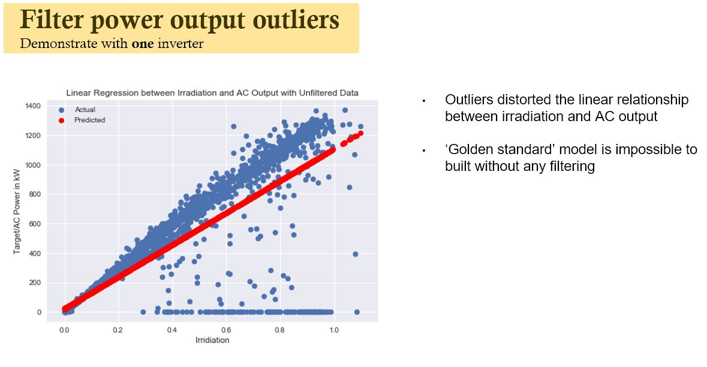
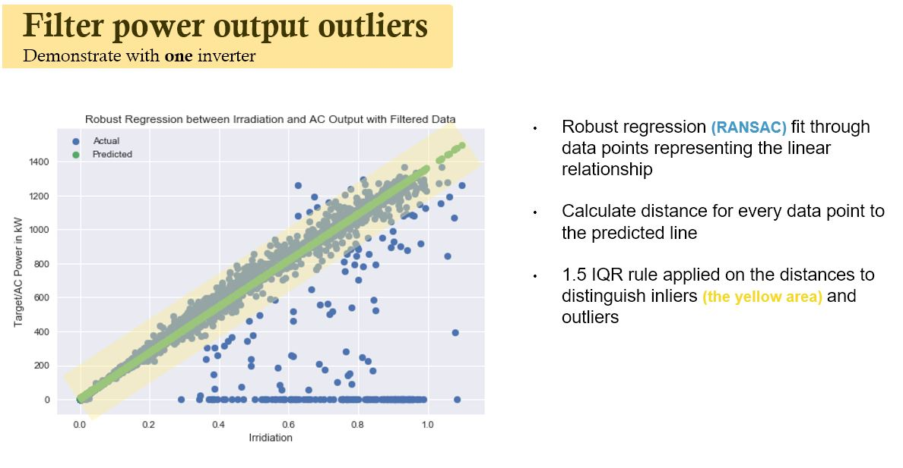
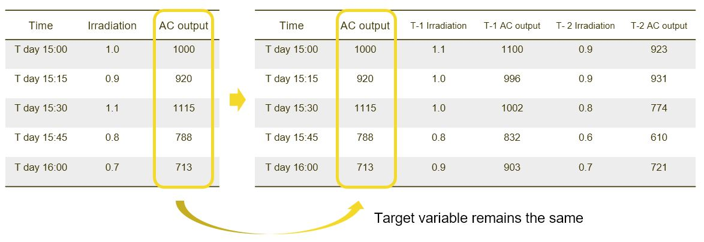
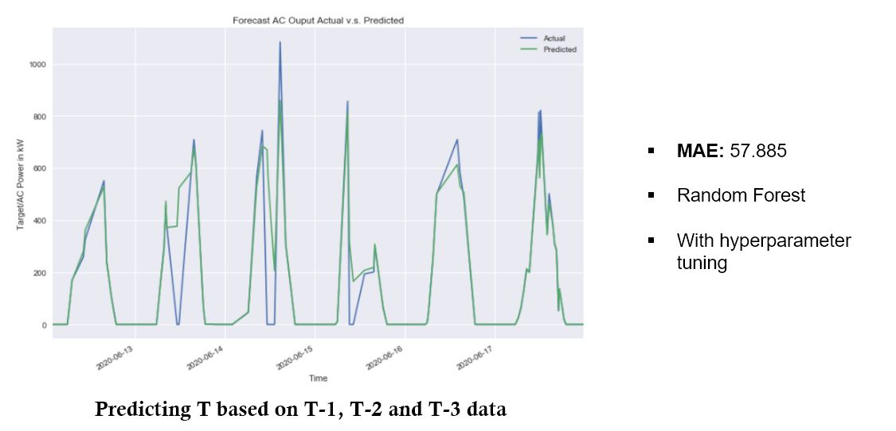

# **Portfolio**

---

# **Predictive Analytics**
## **Identify performance issues in a wind farm and predict future power outputs**

### **Introduction**
This project aims to:
1. detect performance issues in a given wind farm such as certain inverters require slight maintenance or become faulty that require replacement.
2. predict windfarm output in the short future for better grid management.

Data source: [kaggle](https://www.kaggle.com/anikannal/solar-power-generation-data)

### **Project Highlights**
#### Filter outliers from solar panel's inverter outputs:

In order to identify instances of sub-optimal performance of the inverters, a model that describes the 'optimal' performance needs to be constructed. And any actual output significantly deviates from the predicted value of this 'optimal' performance model would be deemed as problematic that requires further processing.

Data Before filtering

Data filtering process

#### Predict future power outputs based on historical data:

In order to perdict future power outputs based on historical data, time-series analysis is required. But traditional univariate time-series models' perfromance is limited (more biased) as they rely only on time and the target variable itself to make predictions. In this project we assume that the current time T is only dependent on the past X time periods. Using data manipulation, a dataset is constructed as below.

Data manipulation

After data manipulation, the time-series problem could be converted to an I.I.D (Independent and Identically Distributed) problem. Conventional ML model such as random forest could be used to make predictions.

Prediction

### **Project Delivery**

[Project presentaion](/pdf/WindFarm_Presentation.pdf)

[Project report](/pdf/WindFarm_Report.pdf)

---
[Project 2 Title](/pdf/WindFarm.pdf)

---
[Project 3 Title](http://example.com/)

---

### Category Name 2

- [Project 1 Title](http://example.com/)
- [Project 2 Title](http://example.com/)
- [Project 3 Title](http://example.com/)
- [Project 4 Title](http://example.com/)
- [Project 5 Title](http://example.com/)

---

---

Page template forked from <a href="https://github.com/evanca/quick-portfolio">evanca</a>

<!-- Remove above link if you don't want to attibute -->
