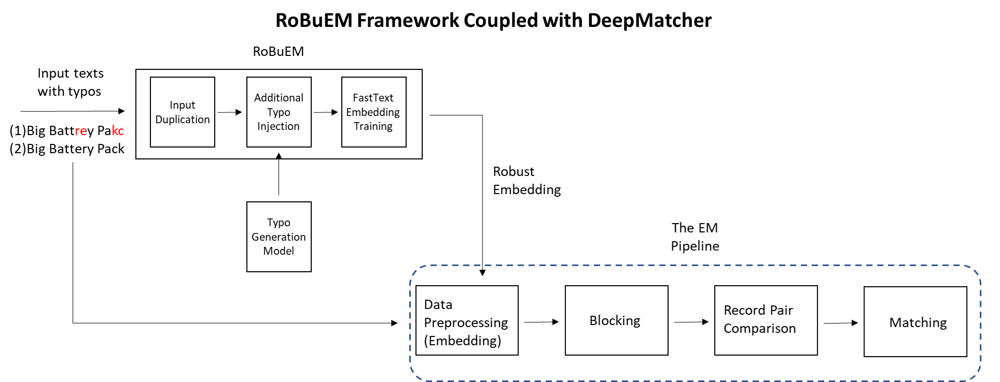

# **Portfolio**

---
## **Data Analytics**

### **Project 1:**  Solar Power Plant Performance Analysis
Solar panel power generation could be impacted by various factors beyond irradiation such as dust covering, faulty equipments etc. This project aims to detect performance issues in a given solar plant, identify inverters with underperforming panels that needs cleaning or maintenance. 
[Python](#tag); [EDA](#tag); [Clustering](#tag); [Time Series Analysis](#tag); [Regression Analysis](#tag)
 

**Visualizations:** 
 
 
  

**Code:**  

Data source: [Kaggle](https://www.kaggle.com/anikannal/solar-power-generation-data)  
More details: [GitHub](https://github.com/mx-hxh/colab-solar)
&nbsp; &nbsp; 

### **Project 2:**  Decoding Epistemic Injustice towards Women on Wikipedia
Epistemic injustice is related to knowledge. Women have suffered from such injustice by being historically underdocumented and their achievements less acknowledged. This project aims to extract article counts about men and women and those articles' respective page view data from Wikipedia's query and REST API services to understood how women are underdocumented on this primary open source knowledge platform. 
[Python](#tag); [SPARQL](#tag); [REST API](#tag); [Multiprocessing](#tag); [Tableau](#tag)
 

 **Visualization**: 
  
[View Full in Tableau Public](https://public.tableau.com/app/profile/miao.xi/viz/DecodingEpistemicInjusticetowardsWomenonWikipedia/Dashboard)
 

**Code**: 

 
Data source: [Wikidata](https://query.wikidata.org/)  
More details: [GitHub](https://github.com/mx-hxh/epistemic-injustice-on-wikipedia)
&nbsp; &nbsp; 

---

## **Natural Language Processing**

### **Project 1:** RoBuEM - Robust Embedding for Deep Entity Matcher against Input Noise
[Deep entity matcher](https://pages.cs.wisc.edu/~anhai/papers1/deepmatcher-sigmod18.pdf) leverages the STOA word embeddings and deep learning models to identify same entities between largely different data sources. But human input errors such as typos pose challenge to such task becuase most embeddings are trained on error free corpus hence performs not well against noisy records with high level of typos. This project proposed a solution that generates robust word embedding using [FastText](https://fasttext.cc/) model from scratch based on the input datasets. Hence, it is customizable on any given EM task. 
[Python](#tag); [NLP](#tag); [Deep Learning](#tag); [Entity Matching](#tag); [Word Embedding](#tag)
 

**Visualizations:** 
 
 
  

**Code:**  

Data source: [DeepMatcher Paper](https://github.com/anhaidgroup/deepmatcher/blob/master/Datasets.md)  
More details: [GitHub](https://github.com/mx-hxh/robust-entity-matching); [Project Report](pdf/robuem_report.pdf)
&nbsp; &nbsp; 

---

Page template forked from <a href="https://github.com/evanca/quick-portfolio">evanca</a>

<!-- Remove above link if you don't want to attibute -->
