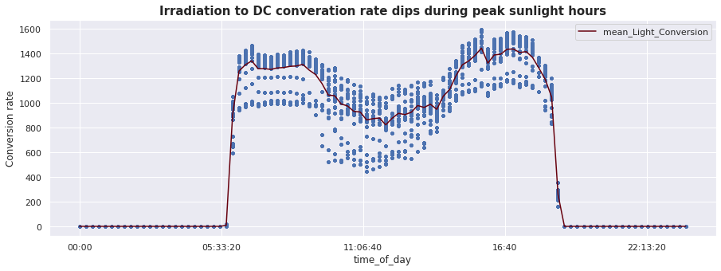

# **Portfolio**

---
## **Data Analytics**

### **Project 1:**  Solar Power Plant Performance Analysis
Solar panel power generation could be impacted by various factors beyond irradiation such as dust covering, faulty equipments etc. This project aims to detect performance issues in a given solar plant, identify inverters with underperforming panels that needs cleaning or maintenance.  

**Visualizations:** 
 
 
  

**Code:**  

Data source: [Kaggle](https://www.kaggle.com/anikannal/solar-power-generation-data)  
More details: [GitHub](https://github.com/mx-hxh/colab-solar)
&nbsp; &nbsp; 

**Project 2:** detect epistemic injustice towards women on Wikipedia
  

 **Visualization**: 
  

**Code**: 

 
Data source: [Wikidata](https://query.wikidata.org/)  
More details: [GitHub](https://github.com/mx-hxh/epistemic-injustice-on-wikipedia); [Tableau Public](https://public.tableau.com/app/profile/miao.xi/viz/DecodingEpistemicInjusticetowardsWomenonWikipedia/Dashboard)
&nbsp; &nbsp; 

---

# **Natural Language Processing**
## **I. Sentiment classification with US Airline twitts**

### **Introduction**
This project aims to classify positive and negative sentiments from a set of unlabeled twitts about major US airlines.

### **Project Delivery**
[Code](/Codes/R/US_Airline_Sentiment)

[Project report](/pdf/USAirline_Report.pdf)

## **II. Food trend identification from facebook posts**

### **Introduction**
This project aims to help identifying food related trends from 4 million food related facebook posts span across 4 years.

### **Project Delivery**
[Code](/Codes/R/Food_Trend_Facebook)

[Project report](/pdf/Cauliflower_Report.pdf)

---

# **Information System & Design**
## **Coming soon!**

---

---

Page template forked from <a href="https://github.com/evanca/quick-portfolio">evanca</a>

<!-- Remove above link if you don't want to attibute -->
